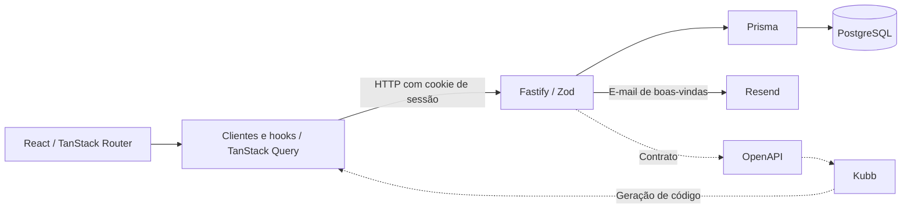

# AuthLab — ArthurLabs

Aplicação web de autenticação com cadastro, login e uma área de membros. Cada conta recebe um número de membro e pode escolher aparecer no mural da comunidade.


## Sobre

O AuthLab é um projeto da ArthurLabs para explorar o fluxo de autenticação em uma aplicação web. A experiência começa no cadastro, passa pelo envio de boas-vindas por e-mail e continua em uma área com o perfil e o mural de membros.

O projeto usa um monorepo com pnpm e Turborepo. A API concentra autenticação e persistência, enquanto a interface consome clientes e hooks gerados a partir do contrato OpenAPI.


## Fluxo da aplicação



A interface envia as ações do usuário à API, que valida os dados, gerencia a autenticação e acessa o banco. O Resend integra o envio de boas-vindas. As linhas tracejadas representam a geração dos clientes e hooks usados pelo frontend a partir do OpenAPI.

## Como rodar

Use Node.js 24 ou superior, pnpm `11.25.0` e Docker Compose.

Na raiz do repositório, instale as dependências e copie os exemplos de ambiente:

```bash
pnpm install
cp .env.example .env
cp packages/web/.env.example packages/web/.env
```

No PowerShell, substitua os comandos de cópia por:

```powershell
Copy-Item .env.example .env
Copy-Item packages/web/.env.example packages/web/.env
```

Configure o ambiente antes de iniciar:

- No `.env` da raiz, mantenha a `DATABASE_URL` do exemplo para usar o PostgreSQL local e preencha `RESEND_API_KEY`.
- Em `packages/web/.env`, use `VITE_URL=http://localhost:8080` para conectar a interface à API.
- Para enviar e-mails com sua própria conta Resend, ajuste o remetente usado no cadastro para um endereço autorizado. Atualmente ele é fixo; a variável `EMAIL_FROM` ainda não é utilizada pelo envio.

Inicie o banco:

```bash
docker compose up -d postgres
```

Aguarde o PostgreSQL estar pronto e execute:

```bash
pnpm --filter @authlab/database db:deploy
pnpm --filter @authlab/database db:generate
pnpm dev
```

O Docker Compose executa o PostgreSQL na porta `5432`. O pnpm inicia a API na porta `8080` e a interface na porta `3000`.

Acesse a aplicação em [http://localhost:3000](http://localhost:3000).

## Documentação da API

Com a API em execução, a documentação interativa está disponível em **[/docs](http://localhost:8080/docs)**, com as operações, os contratos e os exemplos de uso.
